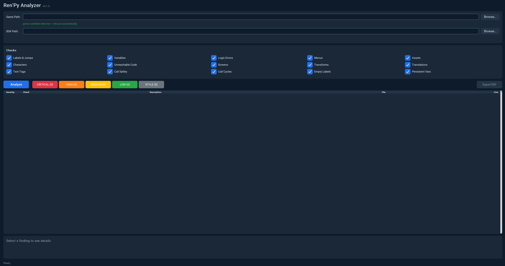

# Ren'Py Analyzer

A desktop GUI tool that scans [Ren'Py](https://www.renpy.org/) visual novel projects for bugs and generates styled PDF reports.

[](https://github.com/Wintersta7e/renpy-analyzer/actions/workflows/ci.yml)


<p align="center">
  
</p>

## What It Does

Ren'Py Analyzer statically analyzes `.rpy` script files and detects common bugs that are easy to miss during development but can cause crashes, broken logic, or cross-platform failures.

### Checks

| Check | Severity | What It Catches |
|-------|----------|-----------------|
| **labels** | CRITICAL/MED | Missing jump/call targets, duplicate labels, unused labels (dead code), dynamic jump/call expression warnings |
| **variables** | CRITICAL/HIGH/MED/LOW/STYLE | Define-mutation (save/load bug), duplicate defaults, persistent-define misuse, builtin shadowing, config runtime mutation, case mismatches, undeclared variables, unused defaults, unpicklable store vars |
| **logic** | CRITICAL/STYLE | Operator precedence bugs (`if A or B == True`), explicit bool comparisons |
| **menus** | HIGH/MED/LOW | Empty choices, fallthrough paths, single-option menus |
| **assets** | HIGH/MED/STYLE | Missing scene images, movie path casing, audio file path validation (sound/voice/music/audio, with Ren'Py `<from N>` / `<fadeout N>` modifier stripping), image subdirectory auto-detection, MP3-for-music warning, reserved-keyword image tags, scene expression file validation |
| **characters** | HIGH/LOW | Undefined speakers, unused character definitions |
| **flow** | HIGH | Unreachable code after jump/return statements |
| **screens** | HIGH | Undefined screen references (show/call/hide screen, `renpy.*_screen` API, `ShowMenu`/`ToggleScreen` actions), duplicate / unused screen defs |
| **screen_syntax** | CRITICAL/HIGH | Ternary `if`/`else` in screen properties (parser breaks), invalid properties on statements, conflicting position props (`xalign`+`xpos`, etc.) |
| **transforms** | HIGH | Undefined transform references, duplicate / unused transform defs |
| **translations** | MED | Duplicate translation blocks (same lang+string_id), incomplete coverage, translate-folder case mismatch |
| **texttags** | HIGH | Unclosed / mismatched / unknown text tags, unescaped `[bracket]` interpolation |
| **callreturn** | CRITICAL/HIGH/MED | Called label never returns, jumps instead of returning, conditional return + jump |
| **callcycle** | CRITICAL | Circular call chains (A→B→A = infinite recursion crash) |
| **callprereqs** | HIGH | `# @requires: var1, var2` annotation enforcement |
| **emptylabels** | HIGH | Labels with no body or only `pass` (unintended fallthrough) |
| **persistent** | HIGH | `persistent.x` used without `default` (breaks on fresh install) |
| **structure** | CRITICAL/MED | Missing `label start:` (game won't launch), `00`-prefixed filenames (engine-reserved) |
| **replay** | HIGH | `Replay()` label missing `renpy.end_replay()` |
| **nvl** | MED | NVL overflow (15+ lines without `nvl clear`) |

### Example Findings (anonymized)

```
[CRITICAL] scripts/chapter01.rpy:1234 — Operator precedence bug: 'FlagA or FlagB == True'
  -> Python parses this as: FlagA or (FlagB == True)

[CRITICAL] scripts/variables.rpy:12 — Defined variable 'points' mutated
  -> Variable declared with 'define' but modified later. Changes lost on save/load.

[HIGH] scripts/variables.rpy:87 — Case mismatch: 'itemCount_Slow_3' vs family 'itemcount_slow_1'
  -> Ren'Py is case-sensitive. Inconsistent casing can cause undefined variable errors.

[MEDIUM] scripts/animations.rpy:45 — Directory case mismatch in path 'images/animations/chapter1/...'
  -> Actual directory is 'images/Animations/'. Works on Windows, fails on Linux/macOS.
```

## Installation

```bash
# Clone the repository
git clone https://github.com/Wintersta7e/renpy-analyzer.git
cd renpy-analyzer

# Install in development mode
pip install -e ".[dev]"
```

### Dependencies

- **customtkinter** — GUI framework (dark mode)
- **reportlab** — PDF report generation
- **Pillow** — Image support (CustomTkinter dependency)
- **click** — CLI interface
- **platformdirs** — Cross-platform user settings directory

## Usage

### GUI Mode (default)

```bash
python -m renpy_analyzer
```

1. Browse to your Ren'Py project folder (or the `game/` subfolder — it auto-detects)
2. Optionally set an SDK path for more accurate parsing
3. Toggle which checks to run
4. Click **Analyze**
5. Review color-coded results
6. Click **Export PDF** to generate a styled report

### CLI Mode

```bash
# Basic analysis
python -m renpy_analyzer --cli /path/to/game

# With specific checks and PDF output
python -m renpy_analyzer --cli /path/to/game --checks Labels,Variables --output report.pdf

# JSON output for tooling
python -m renpy_analyzer --cli /path/to/game --format json

# Use SDK parser for more accurate results (requires --trust-sdk, see below)
python -m renpy_analyzer --cli /path/to/game --sdk-path /path/to/renpy-sdk --trust-sdk
```

Exit codes: `0` = no findings, `1` = findings found, `2` = error or SDK trust/validation refused.

### SDK Parser (Optional)

By default, Ren'Py Analyzer uses a regex-based parser. For more accurate results, you can point it at a Ren'Py SDK installation, which uses the SDK's own parser via a subprocess bridge.

Because the SDK parser spawns the selected SDK's bundled Python interpreter (i.e. executes code from that directory), it is gated behind an explicit opt-in:

- **GUI**: Set the "SDK Path" field to your Ren'Py SDK directory. The GUI will ask you to confirm the SDK is trusted before running the SDK parser; decline to fall back to the regex parser.
- **CLI**: Pass `--sdk-path /path/to/renpy-sdk` **and** `--trust-sdk`. Omitting `--trust-sdk` exits with a clear error pointing at the regex-parser fallback.

Both code paths additionally reject symlinked SDK roots and symlinked Python binaries to prevent path-hijack surprises. The regex parser remains the zero-dependency, zero-execution fallback.

## PDF Report

The generated PDF uses a midnight dark theme and includes:

- Styled title page with project name, date, and finding statistics
- Clickable table of contents with dotted leaders
- Bookmark sidebar for quick navigation
- Color-coded severity badges (vibrant against dark background)
- Tiered display: full cards for CRITICAL/HIGH, compact cards for MEDIUM, table rows for LOW/STYLE
- Identical findings grouped to reduce report noise
- Summary table with counts by category and severity

## Project Structure

```
src/renpy_analyzer/
├── __main__.py         # `python -m renpy_analyzer` entry point (CLI vs GUI)
├── app.py              # GUI (CustomTkinter, dark mode, threaded analysis)
├── analyzer.py         # Core analysis engine (shared by GUI and CLI)
├── cli.py              # CLI interface (click)
├── parser.py           # .rpy file parser -> structured elements
├── project.py          # Project loader: safe file walker, sub-game detection
├── models.py           # Dataclasses for parsed elements + Finding + Severity
├── settings.py         # Persistent settings (SDK paths, preferences)
├── version.py          # Ren'Py version detection + SDK auto-selection
├── log.py              # Structured logging setup
├── bridge_worker.py    # SDK parser worker (runs under SDK Python, 2.7/3.9+ dual-compat)
├── sdk_bridge.py       # Host-side subprocess bridge + SDK trust/symlink validation
├── checks/             # 20 independent check modules (see Checks table above)
│   ├── labels.py, variables.py, logic.py, menus.py, assets.py
│   ├── characters.py, flow.py, screens.py, screen_syntax.py, transforms.py
│   ├── translations.py, texttags.py, callreturn.py, callcycle.py, callprereqs.py
│   ├── emptylabels.py, persistent.py, structure.py, replay.py, nvl.py
│   └── _label_body.py  # shared helper (label-body extraction, cached)
└── report/
    └── pdf.py          # Styled PDF generator (ReportLab, midnight theme)
```

## Development

```bash
# Install with dev dependencies
pip install -e ".[dev]"

# Run all unit tests (<1s)
PYTHONPATH=src python3 -m pytest tests/ --ignore=tests/test_integration.py -q

# Run a specific test file
PYTHONPATH=src python3 -m pytest tests/test_parser.py -v

# Run integration tests (~6 min, requires real game project)
PYTHONPATH=src python3 -m pytest tests/test_integration.py -v
```

### Test Suite

- **500+ unit tests** covering parser, models, project loader, analyzer, GUI, CLI, PDF, logging, SDK bridge (including trust gating + symlink rejection), and all 20 check modules.
- Integration tests (optional, `tests/test_integration.py`) exercise the pipeline against a real project — skipped in the default command above; run with `PYTHONPATH=src python3 -m pytest tests/test_integration.py` to include them.

### Building Windows Executable

```bash
# Using PyInstaller with the included spec file
python -m PyInstaller renpy_analyzer.spec --clean --noconfirm
```

Output: `dist/RenpyAnalyzer.exe` (~18MB single-file executable).

## How It Works

```
.rpy files -> Parser -> Project Model -> Checks -> Findings -> Report (GUI / PDF)
```

1. **Project loader** discovers all `.rpy` files recursively in the `game/` directory
2. **Parser** reads each file using regex patterns (or SDK parser if configured) to extract labels, jumps, calls, variables, menus, scenes, characters, images, music references, conditions, and dialogue
3. **Check modules** receive the full project model and independently analyze it for issues
4. **Findings** are collected with severity, file location, message, and explanation
5. **Report** displays findings in the GUI results list and/or exports to a styled PDF

### Ren'Py-Specific Features

- Handles indented labels (nested inside `if`/`menu` blocks) and dotted sublabels (`.intro`, `parent.child`)
- Scans `game/images/` for auto-discovered images with subdirectory support
- Pattern-based case mismatch detection for numbered variable families (e.g., `varName_1` vs `varname_2`)
- Understands `default`, `define`, `$` assignments, augmented assignments (`+=`)
- Parses menu blocks with dynamic indent detection (2-space, 4-space, tabs, column 0)
- Parses all audio channels: `play music/sound/voice/audio`, `queue`, standalone `voice`, `stop` (both single- and double-quoted paths)
- Strips Ren'Py audio modifier prefixes (`<from N>`, `<to N>`, `<loop N>`, `<fadeout N>`, `<fadein N>`, `<silence N>`, `<sync tag>`) before filesystem lookup
- Multi-word image names in `scene`/`show` statements; scene expression file-path validation
- Dynamic `jump expression` / `call expression` detection
- Init / screen / python block context tracking (skips dialogue and conditions inside `python:` / screen bodies)
- Text-tag validation with stack-based matching and `[interpolation]` escape detection
- Translation block duplicate / incomplete-coverage detection
- Filters Ren'Py built-in images (`black`, `white`), keywords (`narrator`, `extend`), built-in screens and built-in transforms from checks
- Multi-game projects: auto-detects sub-game directories and analyzes each independently, prefixing findings with the sub-game name
- `.rpa` archive awareness: downgrades missing-label / missing-label-start findings with a qualifying note when scripts may live inside archives

## Disclaimer

This project is not affiliated with, endorsed by, or sponsored by the [Ren'Py](https://www.renpy.org/) project or Tom Rothamel. "Ren'Py" is a registered trademark of Tom Rothamel. This tool uses the name solely to describe its purpose: analyzing Ren'Py project files.

The optional SDK parser feature invokes the user's own locally-installed Ren'Py SDK via subprocess. No Ren'Py code is bundled or redistributed with this tool.

## License

MIT — see [LICENSE](LICENSE) for details.
